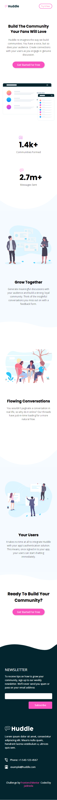

# Frontend Mentor - Huddle landing page with curved sections solution

This is a solution to the [Huddle landing page with curved sections challenge on Frontend Mentor](https://www.frontendmentor.io/challenges/huddle-landing-page-with-curved-sections-5ca5ecd01e82137ec91a50f2). Frontend Mentor challenges help you improve your coding skills by building realistic projects. 

## Table of contents

- [Overview](#overview)
  - [The challenge](#the-challenge)
  - [Screenshot](#screenshot)
  - [Links](#links)
- [My process](#my-process)
  - [Built with](#built-with)
  - [What I learned](#what-i-learned)
  - [Continued development](#continued-development)
  - [Useful resources](#useful-resources)
- [Author](#author)
- [Acknowledgments](#acknowledgments)

## Overview
- This is a responsive landing page for Huddle which was created with HTML and CSS (SCSS). 

### The challenge

Users should be able to: 

- View the optimal layout for the site depending on their device's screen size
- See hover states for all interactive elements on the page

### Screenshot

- Desktop

- Mobile

### Links

- Solution URL: [Add solution URL here](https://github.com/jadesolayo/huddle-landing-page-with-curved-sections-master)
- Live Site URL: [Add live site URL here](https://huddle-landing-page-curved-by-jade.netlify.app/)

## My process
 I started with the html layout and then I started adding CSS codes as I went. This layout was achieved easily with CSS Flexbox which in turn also made it easily responsive and adaptive to all screen sizes. I also experimented with SASS a little. I also used a desktop frst in this project.
 
### Built with

- Semantic HTML5 markup
- CSS custom properties
- Flexbox
- Dektop-first workflow
- SCSS 

### What I learned

- During the course of this peoject, I used Sass in place of CSS. This is my first time i'll be implementing Sass in any of my projects. I only did basic things with Sass such as sass mixins, sass nesting, how to use sass variables and sass @include rule. I also made sure to give the content a maximum width so that the content will stop growing when it gets to a certain width  
. I learnt this from a colleague when I submitted my last project. 

Another thing that gave me a tough time was how to write media queries with Sass. It took me a while before I got a hang of it.

All in all, the project was a good one which helped me in sharpening my CSS skills and also gave me an insight on how to use Sass.

### Continued development

In future projects, I will like to continue to implementing sass going forward as it helped me keep my styles organized and also helped me get rid of repeating styles. I'll also love to implement more media queries with Sass and also learn BEM.

## Author

- Website - [Jadesola](https://app.netlify.com/sites/huddle-landing-page-curved-by-jade/overview)
- Frontend Mentor - [@jadesolayo](https://www.frontendmentor.io/profile/jadesolayo)
- Twitter - [@jade_babyyyyy](https://www.twitter.com/jade_babyyyyy)
